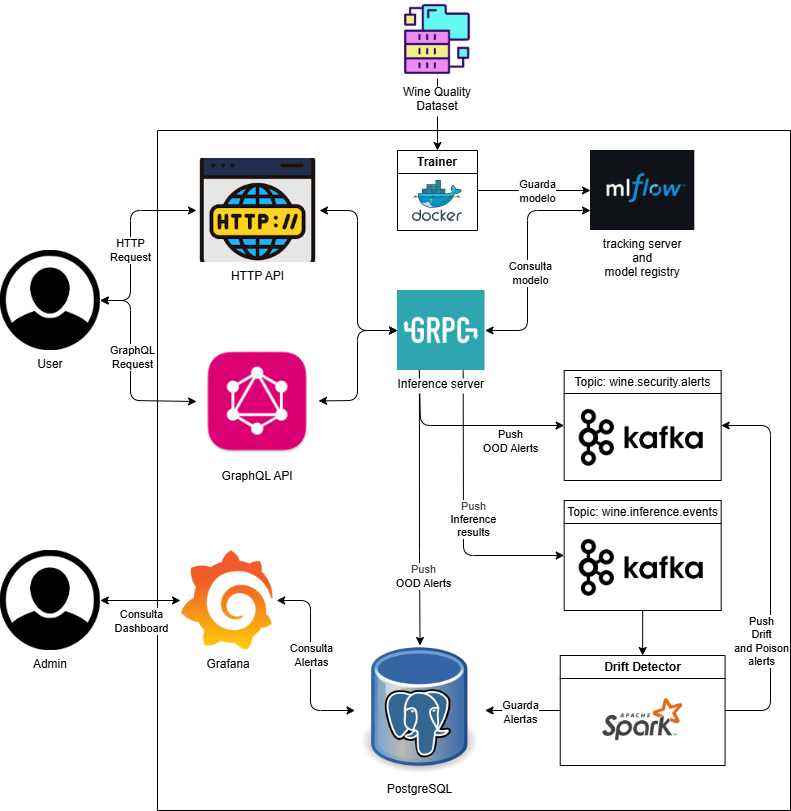

# MLOps 2 - Trabajo Final

## Integrantes

- Acevedo Zain, Gaspar (acevedo.zain.gaspar@gmail.com)
- Borda, Jonathan (jonathanmatiasborda@gmail.com)
- Villalobos, Carlos (carlosvillalobosh3@gmail.com)

## ¿En qué consiste este trabajo?

Este trabajo consiste en un *servidor de inferencia* que permite clasificar la calidad de un vino a partir de determinados datos.
En cada predicción se realiza un análisis para detectar *data-drift*, *data-poisoning* y *out-of-distribution detection*.
Cada caso positivo genera una alerta distinta, la cual es persistida en una base de datos *PostgreSQL*.
Todas las alertas generadas son graficadas en dashboard de *Grafana*, con el fin de que un determinado usuario/administrador pueda tomar las decisiones pertinentes.

### ¿Cuáles son los componentes del sistema?

A continuación, se detallan los componentes del sitema



- [Trainer](./trainer/): entrena un modelo **LogisticRegression** utilizando el [Wine Quality Dataset](https://www.kaggle.com/datasets/yasserh/wine-quality-dataset) y lo registra en `MLFlow`.
- [MLFlow](./mlflow/): tracking server y model registry. Permite loguear modelos y metricas de estos.
  - Implementa `Minio` para almacenar datos.
  - Implementa `PostgreSQL` para almacenar datos.
- [gRPC server](./grpc-server/): *servidor de inferencia*, que permite realizar predicciones como así también generar distintos tipos de alertas.
  - Mediante el endpoint `Predict`, permite realizar predicciones utilizando el modelo **LogisticRegression**, el cual obtiene desde `MLFlow`.
  - Por cada predicción realizada, envía un mensaje con sus datos y resultados al *topic* de `Kafka` de `wine.inference.events`.
  - Por cada predicción realizada, realiza un análisis de *out-of-distribution detection*. Los resultados se envían al *topic* de `Kafka` de `wine.security.alerts`, como así también se persisten en las tablas `security_alerts` y `ood_alerts` de `PostgreSQL`.
- [REST API](./http-api/): HTTP REST API. Expone el endpoint `predict`, el cual permite realizar predicciones de la calidad de un vino. Internamente, llama al [gRPC server](./grpc-server/).
- [GraphQL API](./graphql-api/): API GraphQL (Strawberry) que expone una mutation `predict` cargando el modelo desde MLflow (puerto 8090).
- `Kafka`: se utiliza como broker de mensajes.
  - El topic `wine.inference.events` contiene mensajes con información de cada predicción realizada. Estos son los datos enviados por los usuarios, como así también los resultados.
  - El topic `wine.security.alerts` contiene alertas de `drift detection`, `poisoning detection` y `out-of-distribution detection`.
- [Spark Drift Detector](./spark-drift-detector/): Permite detectar corrimiento de las distribuciones de los datos mediante el uso de `Spark`.
  - Analiza los mensajes del topic `wine.inference.events`, utilizando una determinada ventana de tiempo.
  - En caso de detectar un caso de `drift` y/o `poisoning` de datos, genera un alerta al *topic* de `wine.security.alerts`, como así también se persiste en la tabla `security_alerts` de `PostgreSQL`.
- `PostgreSQL`: base de datos en donde se persisten datos de las distintas alertas detectadas por el sistema. También persiste información relacionada al servidor de `MLFlow`.
  - Tabla `security_alerts`: contiene información de alertas del tipo `drift`, `poisoning` y `out-of-distribution`.
  - Tabla `ood_alerts`: contiene información exclusiva de alertas del tipo `out-of-distribution`.
- [Grafana](./grafana/): permite visualizar, monitorear y analizar en tiempo real las alertas de detección de `data-drift`, `data poisoning` y `out-of-distribution`.

**Otros componentes**

- Carpeta [proto](./proto/): contiene la definición del esquema y los contratos utilizados por el *servidor de inferencia* [gRPC server](./grpc-server/).
- Carpeta [protogen](./protogen/): contiene el código generado a partir de los stubs de gRPC. **NO** debe ser modificado.
- Carpeta [reference](./reference/): contiene los siguientes archivos de utilidades:
  - [ood_reference_stats](./reference/ood_reference_stats.npz): estadísticas de referencia utilizadas para detectar `out-of-distribution`, mas precisamente, la media y la inversa de la matriz de covarianzas del dataset.
  - [reference_stats](./reference/reference_stats.json): contiene estadísticas de la media, la varianza, el valor máximo y el valor mínimo de cada variable del dataset. Se utiliza para detectar `drift` o `poisoning` de datos.
- Carpeta [scripts](./scripts/): contiene el archivo [generate_traffic.py](./scripts/generate_traffic.py), que permite generar tráfico **FALSO** a fin de analizar qué tan bien detecta el sistema los distintos tipos de alertas.

### Detección de alertas

Este sistema tiene como objetivo realizar predicciones relacionadas a la calidad de un vino dados sus datos.

Si bien las distribuciones del dataset [Wine Quality Dataset](https://www.kaggle.com/datasets/yasserh/wine-quality-dataset) son conocidas, al poner el sistema en producción y disponibilizarlo para distintos usuarios, puede llegar a suceder que se reciban datos que estén **fuera** de estas distribuciones.

Estos casos deben ser detectados y analizados correctamente, ya que resulta fundamental determinar si corresponden a un cambio *natural* de las distribuciones, errores de los usuarios, o incluso ataques maliciosos.

Por este motivo, se propone detectar y persistir para su posterior análisis los siguientes tipos de alertas:

- Data drift y data poisoning: se determina mediante una ventana de tiempo. Se hace en paralelo ya que pueden ocurrir a la vez.
- **Out-of-distribution**: a diferencia del caso anterior, este tipo de análisis se puede hacer por cada petición recibida.

### Alerta Out-of-distribution

Nuestro modelo fue entrenado con dataset cuyos datos tienen distribuciones predeterminadas. No obstante, puede suceder que al, momento de realizar inferencias, el modelo trabaje con datos que no estuvieron disponibles en tiempo de entrenamiento.

Estos datos pueden corresponder a errores en los inputs, actividad maliciosa, *outliers* estadísticos o incluso a un corrimiento orgánico de la distribución original.

Aquí es donde aparece la detección de casos `out-of-distribution`, es decir, detectar aquellos casos en los que a un modelo se les presenta un dato que no pertenece a las categorías o patrones estadísticos con los que fueron entrenados.

En este trabajo, se busca detectarlos mediante un método **post-hoc** (agnóstico al entrenamiento), más precisamente, mediante la distancia de **Mahalanobis**. Esta mide cuántos *desvíos estandar* de diferencia hay entre un punto dado y la media de un *feature* determinado, considerando la "forma" de los datos (covarianza).

**¿Cómo calculamos esto?**

Al momento de entrenar el dataset, para cada *feature* se obtiene su `media` y su `matriz de covarianza` (más precisamente, su inversa, utilizando la función [linalg.inv](https://numpy.org/doc/stable/reference/generated/numpy.linalg.inv.html) de *numpy*). Estos datos se guardan en el archivo [ood_reference_stats.npz](./reference/ood_reference_stats.npz).

Posteriormente, luego de cada predicción, [grpc-server](./grpc-server/) realiza el cálculo de la distancia de **Mahalanobis**, y en función del resultado se determina si es un caso de distribución **alta**, **media** o **baja**.
Los rangos utilizados son:

- **Alta**, si el valor es superior a $25$.
- **Bajo**, si el valor es inferior a $10$.
- **Medio**, en otros casos.

Los límites pueden ser configurados mediante los valores `OOD_HIGH` y `OOD_LOW`.

Todos los resultados son registrados como alertas, indicando su valor numérico y su calificación en alta/media/baja. Posteriormente, se guardan en la base de datos de `PostgreSQL` (tablas `ood_alerts` y `security_alerts`).

**Fuentes**

- Papers
  - [Out-of-Distribution Detection: A Task-Oriented Survey of Recent Advances](https://dl.acm.org/doi/10.1145/3760390).
  - [Mahalanobis++: Improving OOD Detection via Feature Normalization](https://arxiv.org/abs/2505.18032).
  - [Out-of-distribution Detection in High-dimensional Data Using Mahalanobis Distance- Critical Analysis](https://www.iccs-meeting.org/archive/iccs2022/papers/133500260.pdf).
- Artículos
  - [Out of Distribution Detection: Knowing When AI Doesn't Know](https://www.sei.cmu.edu/blog/out-of-distribution-detection-knowing-when-ai-doesnt-know/).
  - [Out-of-distribution detection I: anomaly detection](https://rbcborealis.com/research-blogs/out-distribution-detection-i-anomaly-detection/).
  - [Mahalanobis Distance usage in Machine learning](https://dilipkumar.medium.com/mahalanobis-distance-usage-in-machine-learning-2bd4bcacbcd2).

## How-to

### ¿Cómo ejecutar la aplicacion?

**Prerequisito**

1. Crear stubs de gRPC:
   1. `make proto`
      1. Alternativamente `make proto PYTHON=python` o `make proto PYTHON=python3` para indicar el interprete de python a utilizar.

**Mediante Docker compose**

1. `docker compose up -d`
   1. Alternativa: `docker compose up --build -d` para hacer build de la aplicacion
2. `docker compose down -v` para eliminar los containers + volumenes.

**Mediante makefile**

1. `make up`
   1. Alternativa: `make up-build` para hacer build de la aplicacion
2. `make down` para eliminar los containers + volumenes.

### ¿Cómo hacer llamados a la REST API?

Documentación interactiva (Swagger UI): [http://localhost:8080/docs](http://localhost:8080/docs)

```bash
curl http://localhost:8080/health
```

```bash
curl -X POST http://localhost:8080/predict \
  -H "Content-type: application/json" \
  -d '{
    "alcohol": 13.2,
    "malic_acid": 1.7,
    "ash": 2.3,
    "alcalinity_of_ash": 15.6,
    "magnesium": 98,
    "total_phenols": 2.8,
    "flavanoids": 3.0,
    "nonflavanoid_phenols": 0.3, 
    "proanthocyanins": 1.9,
    "color_intensity": 5.5,
    "hue": 1.0,
    "od280_od315": 3.2,
    "proline": 520
  }'
```

### ¿Cómo hacer llamados a la GraphQL API?

Documentación interactiva (GraphiQL): [http://localhost:8090/graphql](http://localhost:8090/graphql)

Health:

```bash
curl http://localhost:8090/health
```

Mutation `predict` con `curl` (los campos del input van en **camelCase** en GraphQL):

```bash
curl -s http://localhost:8090/graphql \
  -H "Content-Type: application/json" \
  -d "{\"query\":\"mutation { predict(features: { alcohol: 13.2, malicAcid: 1.7, ash: 2.3, alcalinityOfAsh: 15.6, magnesium: 98, totalPhenols: 2.8, flavanoids: 3.0, nonflavanoidPhenols: 0.3, proanthocyanins: 1.9, colorIntensity: 5.5, hue: 1.0, od280Od315: 3.2, proline: 520 }) { predictedClass modelVersion } }\"}"
```

Misma mutation en GraphiQL:

```graphql
mutation {
  predict(
    features: {
      alcohol: 13.2
      malicAcid: 1.7
      ash: 2.3
      alcalinityOfAsh: 15.6
      magnesium: 98
      totalPhenols: 2.8
      flavanoids: 3.0
      nonflavanoidPhenols: 0.3
      proanthocyanins: 1.9
      colorIntensity: 5.5
      hue: 1.0
      od280Od315: 3.2
      proline: 520
    }
  ) {
    predictedClass
    modelVersion
  }
}
```

### ¿Cómo ejecutar el generador de tráfico?

**Mediante python**

Ejecutar `python scripts/generate_traffic.py` en una terminal.

**Mediante makefile**

1. `make drift-traffic`
   1. `make drift-traffic PYTHON=python` o `make drift-traffic PYTHON=python3`

**Recomendaciones**

Ejecutar en una terminal el siguiente comando para observar en tiempo real como Kafka procesa los eventos que recibe del *inference server*.
***NOTA***: se puede ejecutar en Linux y Windows (sacar `sudo`).

```bash
sudo docker exec -it kafka kafka-console-consumer --bootstrap-server kafka:9092 --topic wine.inference.events
```

Para ver la deteccion de data-drift y/o data-poisoning:

```bash
sudo docker exec -it kafka kafka-console-consumer --bootstrap-server kafka:9092 --topic wine.security.alerts
```

Para verlos desde el comienzo:

```bash
sudo docker exec -it kafka kafka-console-consumer --bootstrap-server kafka:9092 --topic wine.security.alerts --from-beginning
```

<!-- Ejecutar en una terminal para ver los logs (por el momento, prints en pantalla) de cuando se encuentran drifts.
Tambien se recomienda ir al [sitio local de Spark](http://localhost:4040/).
***NOTA***: se puede ejecutar en Linux y Windows (sacar `sudo`).

```bash
sudo docker logs spark-drift-detector
``` -->

### ¿Cómo configurar Grafana?

1. Ir al sitio http://localhost:3000
2. Hacer login con admin user.
3. Una vez hecho login, si grafana solicita cambiar la password, cambiarla o hacer skip.
4. En el panel izquierdo, ir a `Connections/Data Sources`.
5. `Add data source` y luego filtrar por `PostgreSQL`.
6. Completar con los siguientes datos;
   1. Name: cualquier nombre, como `postgresql-source`
   2. Connection:
      1. Host URL: `postgres:5432`.
      2. Database name: `mlflow`.
   3. Authentication:
      1. Username: `mlflow`.
      2. Password: `mlflow`.
      3. TLS/SSL Mode: `disabled`.
   4. Al final de la pagina, clickear `Save & test`. Esto deberia mostrar un mensaje que dice `Database connection OK`.
   5. En la URL, copiar el `UID` del dashboard. Ejemplo: `http://localhost:3000/connections/datasources/edit/***afin5lvhpbls0b***`.
7. Agregar Dashboard
   1. En el panel izquierdo, ir a `Dashboards`.
   2. `Create Dashboard`.
   3. `import`.
   4. Pegar el codigo de [security_alerts.json](./grafana/security_alerts.json).
   5. Presionar `load`.
   6. Luego, cambiar el `UID` con el correspondiente de tu data source.
   7. `Import`.

### ¿Cómo hacer consultas en PostgreSQL?

```bash
sudo docker exec -it postgres psql -U mlflow -d mlflow
```

```bash
SELECT * from security_alerts ORDER BY timestamp DESC;
```

```bash
SELECT * from ood_alerts ORDER BY timestamp DESC;
```
